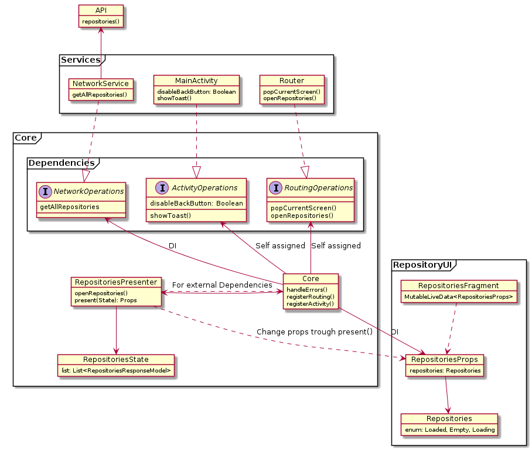

# Description

This project is just a "snapshot" of the architecture approach that was used on the project Forma-Fit.

The project was build with UI-first approach and as a result creation of the Playbook for the fast feedback about new features.

# Architecture

Structure diagram: 



## Description

During **Forma Fit project**, we decided to move with **UI-first** approach for developing an Android application. 
Architecture is divided into two major parts, single **Core** and separated **UI** for every screen or view. 

For **every screen, dialog or view we have UI module** that consists of the `Fragment` (view or activity) and `MutableLiveData<Props>`. Our project was based on Single Activity approach and every screen as a fragment. Props serve as 
Single Source of Truth for the UI and they are connected via **Data Binding**.

## UI Module code example:

```kotlin
class Props1(val value: String, val isLoading: Boolean)

class Fragment1 : Fragment() {

    //Kodein was used in our app, injection will be shown later
    val props: MutableLiveData<Props1> by instance()

    override fun onCreateView(inflater: LayoutInflater, container: ViewGroup, savedInstanceState: Bundle?): View? {
        val binding: FragmentLatestTrainersBinding =
            DataBindingUtil.inflate(inflater, R.layout.fragment1, container, false)

        props.observe(viewLifecycleOwner, Observer {
            binding.props = it
        })

        return binding.root
    }

    ...
}

```
The **Core** module is responsible for managing business logic that modifies **State** of the every UI Module. **Core** module has dependencies for external services, that is connected via interfaces (**NetworkOperations**, **ActivityOperations**, **RoutingOperations**) so it can be easily mocked for testing. 

**Core** creates all **Props** for the UI **Modules** so later on, its injected via Dependency Injection (DI) in the UI module.

## Core code example:

```kotlin
interface Operation {
    fun doSomeOperation()
}

class ExternalOperation: Operation() {
    override fun doSomeOperation() {
        // do something
    }
}

//ExternalOperation is used by the presenters in the next examples
class Core(val someOperation: ExternalOperation) {

    val presenter1 = Presenter(this)
    val props1 = MutableLiveData<Props1>()

}
```

 Buisness logic for every UI model lives in the **Presenter** instances. **Presenters** have access to each other and to the external dependencies via **Core** that is passed in the constuctor.

 ## Presenter code example:
```kotlin
class Presenter1(core: Core) {
    
    fun doSomething() {
        core.someOperation.doSomeOperation()
        core.presenter2.loadScreen2()
        ...
    }
}
```

Every **Presenter** holds state of the **UI module** its responsible for. **Presenter** manages buisness logic of the screen, by converting every change of the state to the new props, by using function `present()`. 
It is the only function from where Props can be changed, so it makes `present()` function Singel Source of Truth for the UI module

## present() code example:
```kotlin
class Presenter1(core: Core) {

    class State1(value: String? = null)

    val state1 = State1()

    fun present() {
        core.props1.value = if (state1.value != null) 
             Props1("Is empty", false)
        else 
            Props1(state1.value, false)   
    }
    
    fun doSomething() {
        core.someOperation.doSomeOperation()
        core.presenter2.loadScreen2()
        ...
        state1.value = "Some value"
        present()
    }
}
```

Everything is wired in the MainApplication using DI (Kodein was used in our case).

## MainApplication code example:

```kotlin
class MainApplication : Application(), KodeinAware {

    override val kodein = Kodein.lazy {

        bind<Context>() with singleton { this@MainApplication }

        bind<Core>() with singleton { Core(instance()) }

        // Network
        bind<IRetrofitService>() with singleton { RetrofitService("https://api.github.com") }

        // Core services
        bind<NetworkService>() with singleton { NetworkService(instance()) }

        bind<MutableLiveData<Props1>>() with provider { instance<Core>().props1 }
    }
}
```

# Playbook

Such a high level of separation of UI from the business logic gives us the ability to build our application with **UI-first** approach. 

## UI-First approach

**UI-first** approach means that when we start to create a new feature, we **always** our first iteration is creation of the fully completed UI. After we have created this UI, it has to be shown to other team members and what is more important, is to show it to the **Design team and Customer**. It allows us to quickly receive feedback about the implementation of the design that our design team had created, also it allows us to get a feel of the UI on the real device and not the static UI of the mockups.


Also, this approach is proved itself to be very useful for finding edge cases in the implemented UI, because you create different cases of your state for the current view, by combining different variations of the **Props** values. This way, you might find different states of the UI that design team or dev team did not foresee and person who is implementing this feature is being able to fix this problems before they reach the QA.

## Playbook example

**Playbook** is another activity, that acts as a **Core** for our **UI-modules**, because they are separated from the buisness logic, it **should not bring any problems** changing sorce of the data for the **UI-modules**.

**Playbook** also has **Props**. But they are not injected by the **DI** and just created inside the **Playbook**. 
**Playbook Props** consist of the list of playbook **Scenes**. Single Scene represents one UI-module (screen, dialog or view). Every **Scene** consist of the list of **Use Cases**. Single Use Case represents a single variation of the state or scripted combination of different states.

**Playbook** also takes care of the **DI and Routing**.  

## Playbook code example:

```kotlin
class PlaybookProps(val scenes: List<PlaybookActivity.PlaybookScene>)

class PlaybookActivity : AppCompatActivity(), KodeinAware {

    class PlaybookScene(val title: String, val useCases: ArrayList<UseCase>) {
        class UseCase(val title: String, val select: Command)
    }

    private val screen1Scene = Screen1Scene()

    private val playbookProps = PlaybookProps(
        listOf(
            PlaybookScene(
                "Screen1", arrayListOf(
                    PlaybookScene.UseCase("Empty", Command {
                        screen1Scene.showEmpty()
                        openScreen1()
                    }),
                    PlaybookScene.UseCase("Loading", Command {
                        screen1Scene.showLoading()
                        openScreen1()
                    }),
                    PlaybookScene.UseCase("Loaded", Command {
                        screen1Scene.showLoaded()
                        openScreen1()
                    })
                )
            )
        )
    )

    override var kodein: Kodein = Kodein.lazy {
        bind<PlaybookProps>() with provider { playbookProps }
        bind<MutableLiveData<Props1>>() with provider { screen1Scene.props }
    }

    override fun onCreate(savedInstanceState: Bundle?) {
        super.onCreate(savedInstanceState)
        setContentView(R.layout.activity_playbook)
    }

    private fun openScreen1() {
        ...
        //Open Screen1
    }
}


```

## Scene code example:

```kotlin
class RepositoriesScene {

    var props = MutableLiveData<Props1>()

    fun showEmpty() {
        props.value = Props1(Props1.Empty)
    }

    fun showLoading() {
        props.value = Props1(Props1.Loading)
    }

    fun showLoaded() {
        props.value = Props1(Props1.Loaded(listOf(//values)))
    }
}
```


